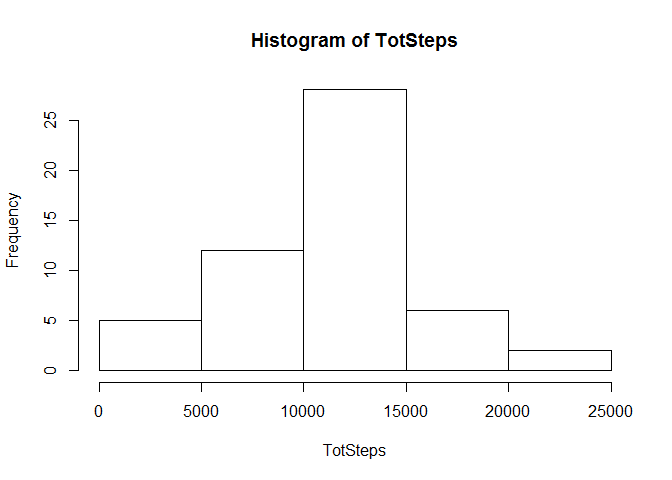
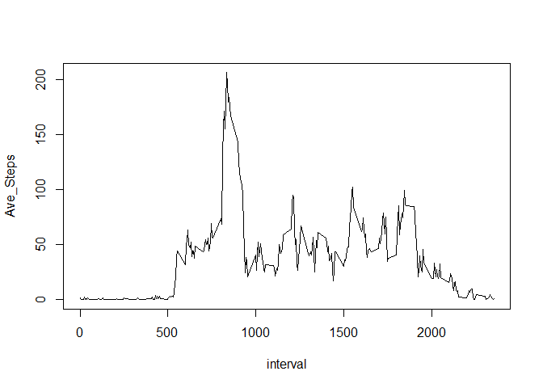
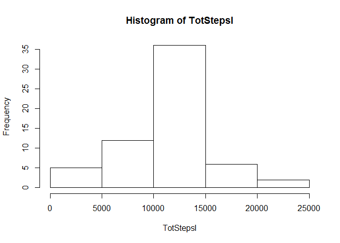
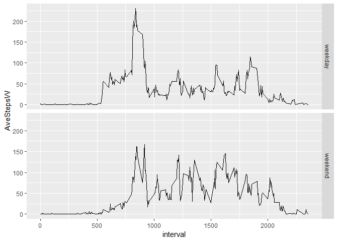

Loading and preprocessing the data
----------------------------------

``` r
Act <-read.csv("activity.csv")
Act <- na.omit(Act)
Act$date <- as.Date(Act$date)
```

What is mean total number of steps taken per day?
-------------------------------------------------

``` r
TotSteps <- tapply(Act$steps,Act$date,sum)
```

### histogram of total steps:

``` r
hist(TotSteps)
```



the mean and median are here

``` r
summary(TotSteps)
```

    ##    Min. 1st Qu.  Median    Mean 3rd Qu.    Max. 
    ##      41    8841   10765   10766   13294   21194

What is the average daily activity pattern?
-------------------------------------------

### time series plot of interval and ave.steps across days

``` r
AveSteps <-
    Act %>% group_by(interval) %>% summarise(Ave_Steps = mean(steps))
plot(AveSteps, type = "l")
```



``` r
MI <- AveSteps[which.max(AveSteps$Ave_Steps),1]
```

maximum number of steps are in interval 'r MI'.

Imputing missing values
-----------------------

``` r
ActFilled <-read.csv("activity.csv")
ActFilled$date <- as.Date(ActFilled$date)
MV <- sum(is.na(ActFilled))
```

toatl number of missing values is 'r MV'

### new dataset with filled data (mean of 5 minute interval for NA's)

``` r
for(i in 1:nrow(ActFilled)) {
    if (is.na(ActFilled[i, ])[1])
        ActFilled[i, 1] <-
            AveSteps[which(AveSteps$interval == ActFilled[i, 3]), 2]
}
```

### histogram of total numbers of steps:

``` r
TotStepsI <- tapply(ActFilled$steps, ActFilled$date, sum)
hist(TotStepsI)
```



### mean and median results:

``` r
summary(TotStepsI)
```

    ##    Min. 1st Qu.  Median    Mean 3rd Qu.    Max. 
    ##      41    9819   10766   10766   12811   21194

Are there differences in activity patterns between weekdays and weekends?
-------------------------------------------------------------------------

### new dataset with factor variable for weekday/weekend:

``` r
ActFilled <-
    mutate(ActFilled, DayType = factor(case_when(
        weekdays(ActFilled$date) %in% c('Saturday', 'Sunday')
        ~ 'weekend',
        TRUE ~ 'weekday'
    )))

head(ActFilled)
```

    ##       steps       date interval DayType
    ## 1 1.7169811 2012-10-01        0 weekday
    ## 2 0.3396226 2012-10-01        5 weekday
    ## 3 0.1320755 2012-10-01       10 weekday
    ## 4 0.1509434 2012-10-01       15 weekday
    ## 5 0.0754717 2012-10-01       20 weekday
    ## 6 2.0943396 2012-10-01       25 weekday

### panel plot for day type:

``` r
AveStepsW <-
    ActFilled %>% group_by(interval,DayType) %>% summarise(AveStepsW = mean(steps))

library(ggplot2)
ggplot(AveStepsW,
       aes(x = interval, y = AveStepsW)) + geom_line() + facet_grid(DayType ~ .)
```


